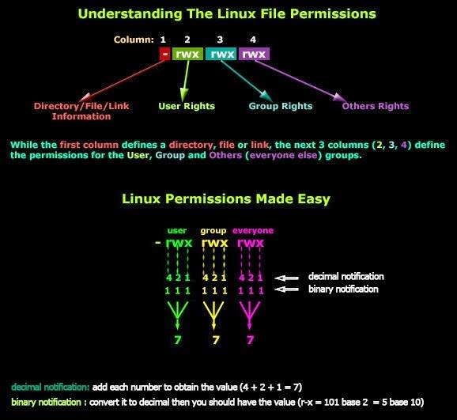

# Unix Basics

## Connecting to `state`

You will first need to connect through `acc.ohsu.edu`

```
ssh laderast@acc.ohsu.edu
```

Once you're in there:

```
ssh state
```

## `pwd` - where am I?

When you sign into your account, you'll be in your *home directory* - this is a directory that houses your files

What is the absolute path to here? You can use `pwd` to find it.

```
pwd
```

## Home Directory Shortcut: `~/`

There is a built in shortcut for your home directory: `~/`

```
cd ~/
```

## File Permissions

`chmod` - please read up on file permissions.



https://haritibcoblog.com/2015/02/08/linux-concepts-filedirectory-permissions/


## Finding Software

What version of R?

`which R`


## Environment Variables

How does Unix know where software is located?

It has to do with providing an *environment* variable.

The one you should be familiar with is `$PATH`, which is a list of directories that linux looks to find software.


```
echo $PATH
echo $HOME
```

## Adding software to your `PATH` using a `.bashrc` file


We will be using our `.bashrc` file to alter settings in our shell, including our `$PATH`. 


```
export PATH="/home/users/laderast/bwa-0.7.17/:$PATH"
```


## Editing your `.bashrc` using `nano`

Make sure you're in your home directory!

```
cd ~/
```

Then open `nano`:

```
nano .bashrc
```

## Note: `.bashrc` lives in your home directory, not elsewhere!


Add the export line to your file:

```
export PATH="/home/users/laderast/bwa-0.7.17/:$PATH"
```

Save and exit (control-x)


## `source`

If you've made changes to your `.bashrc`, then everytime you log in or open a shell, you will execute the contents of `.bashrc`.

If you made a change and want it to run in your current session, you can use `source`:

```
source ~/.bashrc
```

## Check your path and try running bwa

```
echo $PATH

bwa
```

## What did we just learn?

- environment variables (`$HOME` and `$PATH`)
- `export`
- `.bashrc` files
- `nano` for file editing
- adding to our `$PATH` variable
- `source` our `.bashrc`

## `alias`

If you have installed a different version of R, you can create an *alias* in your `.bashrc`:

`alias R2=/usr/bin/R`

Try editing your `.bashrc` to add this line. Then, `source` it.

## End of Day 1


# Dependencies Manager: `conda` and `miniconda`

You may have heard of `anaconda`, which is a software distribution of scientific computing, which includes a wide number of packages.

It has a smaller cousin, called `miniconda`

In general, `miniconda` is a good setup for installing software where you don't have permisison. It is relatively lightweight (400 Mb to start), and will let you install software on remote systems if you don't have admin privileges. 


## Installing `miniconda`

Go to your directory in `/home/courses/BMI535/students/` on `state`.

```
wget https://repo.anaconda.com/miniconda/Miniconda3-latest-Linux-x86_64.sh
sha256sum Miniconda3-latest-Linux-x86_64.sh #Make sure this matches the sum here at
# https://docs.conda.io/en/latest/miniconda.html#linux-installers
# look at python 3.8
bash Miniconda3-latest-Linux-x86_64.sh
```

I'm going to install `miniconda` in my folder on `state`. Agree to the terms, and then when asked, install it to your folder on state:

```
/home/courses/BMI535/students/laderast/miniconda3
```

## Add `miniconda` to your $PATH

Edit your `~/.bashrc` file, and add the installation location to your $PATH:

```
export PATH="/home/courses/BMI535/students/laderast/miniconda3/bin:$PATH"
```

then source your `~/.bashrc` file:

```
source ~/.bashrc
```

check if your `conda` is accessible:

```
which conda
```

## `conda` tutorial

https://geohackweek.github.io/Introductory/01-conda-tutorial/


## `conda` cheatsheet

https://kapeli.com/cheat_sheets/Conda.docset/Contents/Resources/Documents/index


# Shell Scripting

I can't go over all of shell scripting here. We will talk a little bit about shebangs.

https://missing.csail.mit.edu/2020/shell-tools/
https://bash.cyberciti.biz/guide/Shebang


```
#!/usr/bin/env python

print("This is a python script")
```

```
chmod 771 print_this.py
```

```
python print_this.py
```

```
./print_this.py
```

# Very Helpful: `tmux`

When you want to run an interactive job and be able to sign out. Your job will keep running. This is especially helpful when you're on `exacloud`. 

https://www.hamvocke.com/blog/a-quick-and-easy-guide-to-tmux/


# HOSTNAME specific commands


When you are using multiple hosts on the same account, using ``

```
if [[ "$HOSTNAME" = "state" ]]; then
    export PATH="$HOME/FastQC/:$PATH"
fi

if [[ "$HOSTNAME" = "exahead1" ]]; then
    #put export and alias statements specific to exahead1 here
    export PATH="$HOME/:$PATH"
    alias R2=/usr/bin/R
fi

```

# Job Control: `ps` and `kill`

Finding all jobs that you're running:

```
ps -u laderast
```

Killing a job using `kill` (only works on your jobs)

```
kill [jobnum]
```

