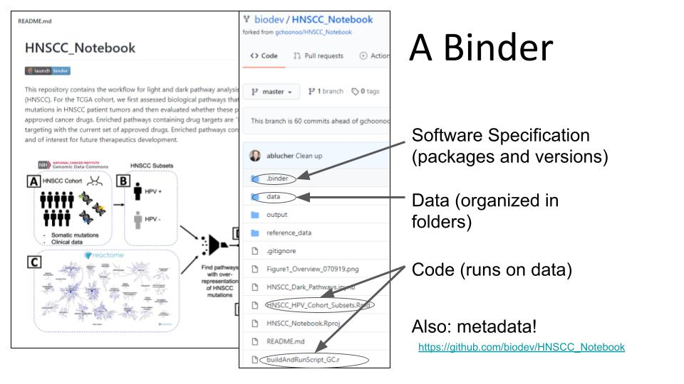
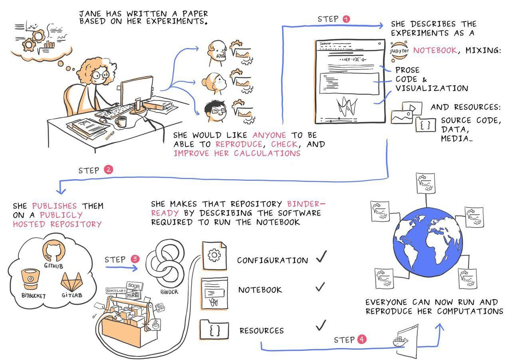

# Introduction to Binder for Reproducible Research

Last week we talked about Docker and how it can enable reproducible research. This week we will be talking about a technology called Binder that leverages Docker so you can share research reproducibly.

## What is a Binder?

A binder is a unit of reproducible research. If I give you a binder link that contains my code, you will be able to reproduce all of the analyses that it contains.

A binder usually lives in a repository, usually GitHub. 

## mybinder.org: a place for sharing Reproducible Research

We'll be using `mybinder.org` to test out a reproducible notebook. It uses a utility called `repo2docker` that converts a github repository to a Docker Container.

You can share your analyses in multiple ways: a Jupyter Notebook, an RStudio Project, or even a Shiny application. 

`mybinder.org` uses donated compute time. You are limited to 1 GB memory and 40 Gb of disk space.

## Sharing Code in a Repository

If you use a *repository* in a project format, you'll be able to share your research.

- Use *relative paths*, not *absolute paths* in your scripts
- Use packages such as `here()` for portable analyses
- Place scripts in the main directory, or use a package that lets you make your scripts more portable {here}
- Place *data* in a sub-directory (usually `data/`). 

https://biodata-club.github.io/talks/repro_paper.pdf

## Specifying a software environment in a Binder

- Specify software environment using config files: [three different methods](https://repo2docker.readthedocs.io/en/latest/config_files.html):
  - `install.R`/`runtime.txt` (for R Projects): https://github.com/ablucher/Workshop_ReproduciblePaper
  - `environment.yml` (for a conda based software environment): https://github.com/binder-examples/python-conda_pip/blob/master/environment.yml
  - `requirements.txt` (for Python Projects): https://github.com/binder-examples/requirements/blob/master/requirements.txt

## Running and Executing a Binder

[demo]

## Some Lessons We learned in Starting a Binder

https://github.com/biodev/HNSCC_Notebook

[A Practical Guide to Reproducible Papers](https://biodata-club.github.io/talks/repro_paper.pdf)

- Requires a lot of distributed expertise (tracking efforts/who did what)
    - Code review should be done within your group
- Code will still be very messy! (that’s ok)
- Making a reproducible container involves a lot of crying and frustration
- Binder can break (can be difficult to maintain)
- Try to version software using version tags
