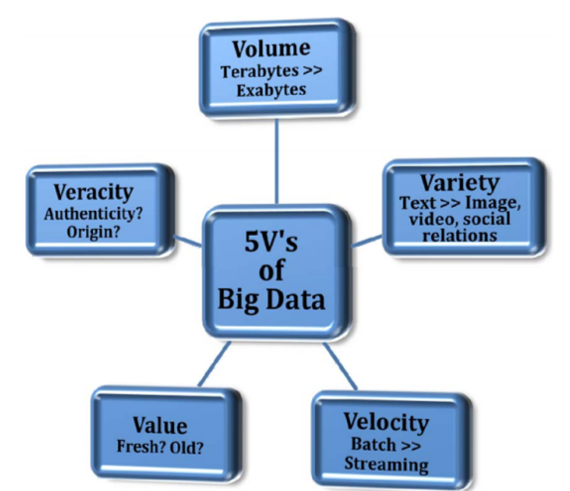
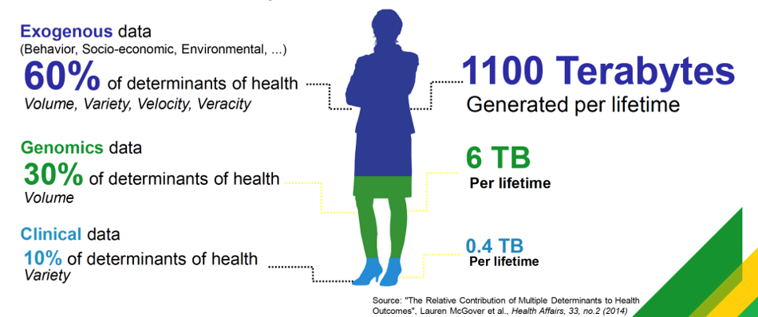
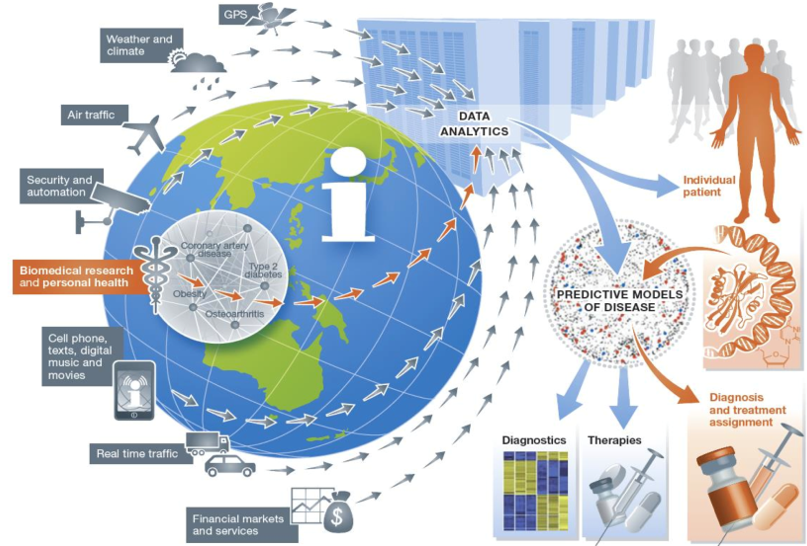
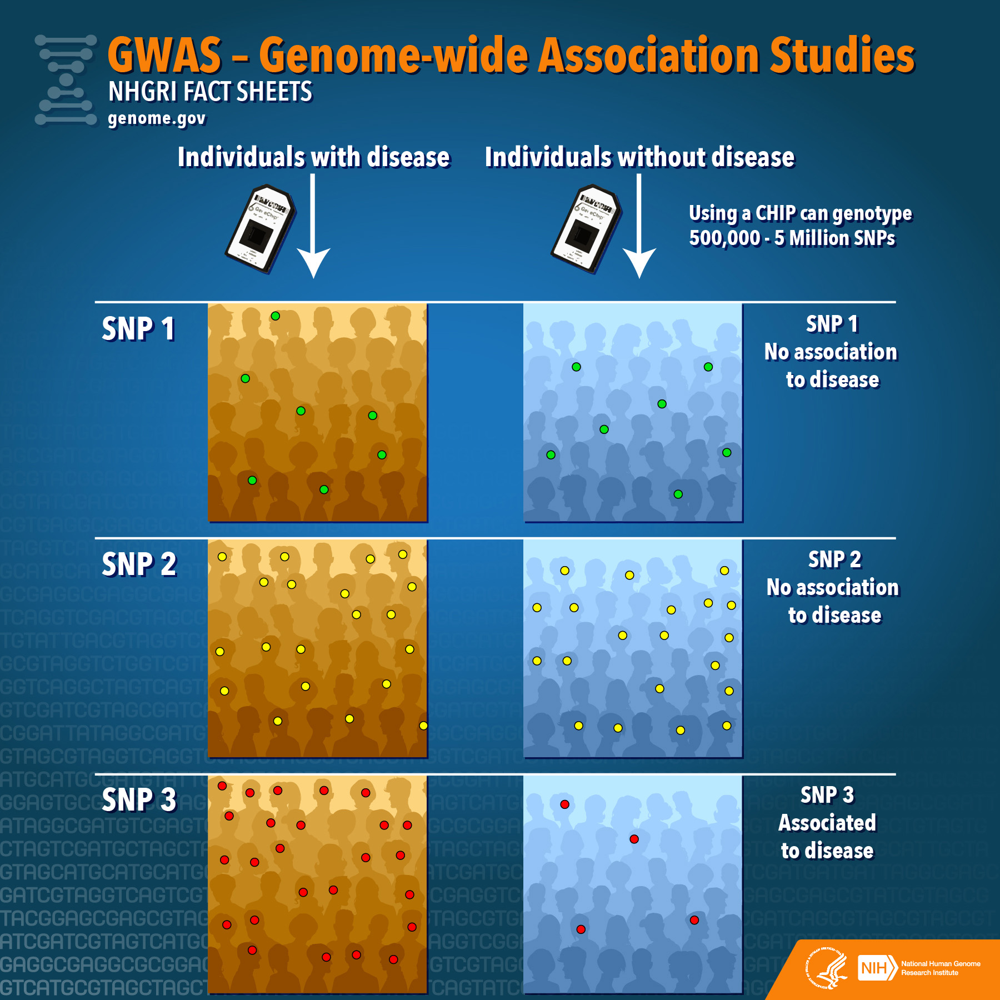
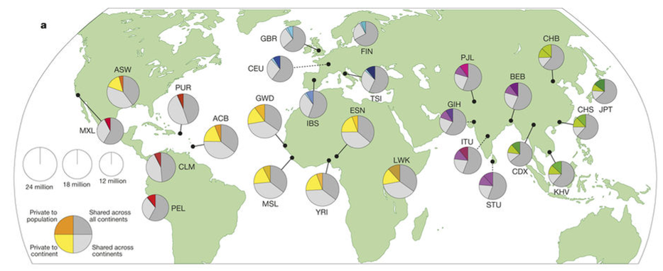
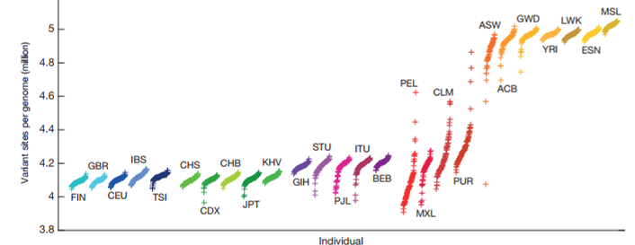
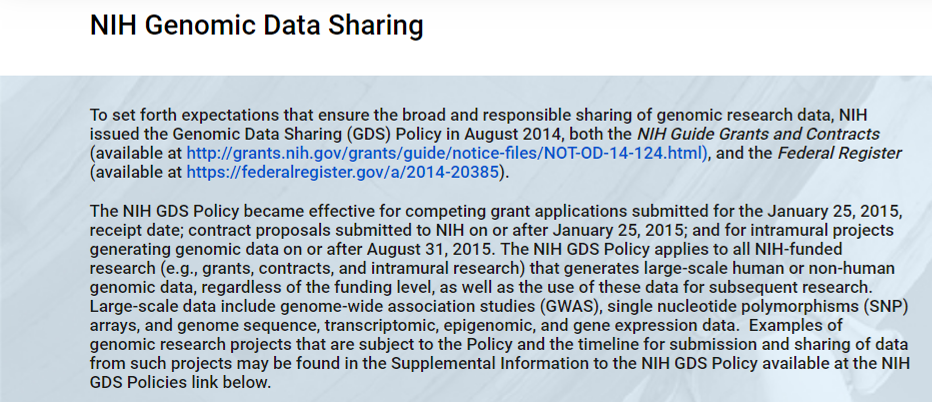

```{r setup, include=FALSE}
options(htmltools.dir.version = FALSE, echo=FALSE)
library(xaringanthemer)
library(xaringanthemer)
mono_light(
  base_color = "midnightblue",
  header_font_google = google_font("Josefin Sans"),
  text_font_google   = google_font("Montserrat", "300", "300i"),
  code_font_google   = google_font("Droid Mono"),
  link_color = "deepskyblue1",
  text_font_size = "28px"
)
```


---
class: center, middle

# Welcome and Introduction

---
# Skills Covered in this Course:

1. **Utilize** alternative data storage and data structures to handle Big Datasets
1. **Create**, **Normalize**, **Load** and **Query** Relational Databases
1. **Understand** the types of NoSQL Databases and their uses
1. **Create** and **Run** jobs on High Performance Computing systems including Exacloud and Amazon Web Services
1. **Understand** and **utilize** the map-reduce programming pattern
1. **Reproduce**, **Implement**, **Debug**, and **Document** an established biomedical data workflow
1. (BMI 635 only) **Design** and **Evaluate** the efficiency of parallelized analysis workflows

---
# Structure of this Course

- Command Line Review
- Useful Data Structures in R/Python for handling Big Data
- High Performance Computing (HPC)
  - Exacloud and Amazon Web Services (AWS)
- Databases
  - Relational Databases
  - NoSQL Databases
- Final Project
---
# Grading

- Assignments: 40%
- Midterm Exam: 20%
- Final Project: 40%

---
# Data is Being collected all the time?

- What are some kinds of big data?

---
# Big Data

Voluminous and complex datasets are being collected all the time! 

We need approaches to using this data:

- capturing; storing; sharing
- analyzing; querying; visualizing
---
```{r echo=FALSE}

```
---
# Big Data and Personalized Medicine

```{r echo=FALSE}

```

---
# Precision Medicine

```{r echo=FALSE}

```
---
# We need lots of genomes to make this happen

.pull-left[

Need to identify associations with disease

- Phenotype information
- Genotype Information]

.pull-right[

  
]

---
# 1000 Genomes Project

International project to construct a foundational data set of human genetics

- discover virtually all common human variation
	- single nucleotide polymorphisms
	- structural variants
	- haplotypes

- develop sequence analysis methods, tools, and reagents that can be transferred to other sequencing projects

---
# (More than) 1000 genomes:

2504 individuals, 26 populations

```{r echo=FALSE}

```
---
# 1000 genomes information

2504 individuals, 26 populations
 - low-coverage whole genome sequencing (mean of 7.4X)
 - deep exome sequencing (mean of 65.7X)
 - dense microarray genotyping

84.7M SNPs, 3.6 million indels, 60,000 structural variants
 - >99% of SNP variants >1% frequency (what does that mean?)

---

# Variation in 1000 genomes

```{r echo=FALSE}

```
---
class: center, middle

# We need more genomes!

---
# Open Respositories of Genomic Data

```{r echo=FALSE}

```

---
# GA4GH

```{r echo = FALSE}

```

---

# DNA: What are some issues?

- Privacy/identifiability
- Using specific genomic markers and de-identified information, we can uniquely identify about 87% of the US population that has participated in either 1000 genomes or GA4GH
---

# Need to protect privacy 

Controlled Access
  - approved access
  - recording/audited queries
  - participant based access

---
# NIH Policy

```{r echo = FALSE}

```

---
class: center, middle

# Back to Big Data

---
# Big Data Processing Strategies

- Massively Parallel Processing
- Cluster Computing
- Map/Reduce

---
# Storing and Querying Big Data

- Data Structures
- Relational Databases
- NoSQL (Not only SQL) Databases
  - Document stores
  - Column stores
  - Graph Databases
  
---
class: center, middle

# Command Line Review 

---
# Our Safe Space: state.ohsu.edu

---
# Reference: Linux Fundamentals

- Paul Cobbaut (see course materials week 1)

---
# Review: Files

- 9.2: Remember that all files are case-sensitive
- 9.3: Everything in unix is a file
    - including folders and devices!

---
# Directory Structure

`/home/its/ug1/eev51vn/report.doc`

```{r echo=FALSE}
knitr::include_graphics("image/file_directories.png")
```

---
# Relative vs. Absolute Paths (8.3)

If I'm in `/home/its/ug1`, how can I refer to `report.doc` from this folder?

```{r echo=FALSE}
knitr::include_graphics("image/file_directories.png")
```

---
# Useful Commands for manipulating files (Chapters 8-10)

Be familiar with the following commands: 

- `ls` - listing files within a directory
- `mv` - move/rename a file
- `rm` - removing files 
- `rm -r` - removing files within a directory (recursive)
- `grep` - look for a pattern/regular expression in a file
- `chmod` - file permissions
- `pwd` - current directory
- `head/cat/tail` - look at the contents of a file

---
# Learn a Command Line text editor (vi/nano, Chapter 22)

- `vi` - guaranteed to be on any linux system
  - A little harder to learn
  - command mode versus insert mode
  - extremely powerful for searching/replacing
- `nano` - usually on any linux system
  - A little easier to learn

---
# Shell Scripting (Chapters 23-26)

- How to set up a shell script
- What a she-bang is (23.3)

---
# Pipes (Chapter 18)

- Know what a pipe `|` is and why it's useful

---
# Scripting Configuration (chapter 14)

- `$PATH` variable (where applications live, 14.8)
- Environment variables (passwords and connections, 14.9)
  - using `.bash_profile` or `.bashrc` files to specify environment variables using `export` (14.10)

---
# Regular Expressions (Chapter 21)

- Used to specify string matching queries
- Highly flexible

