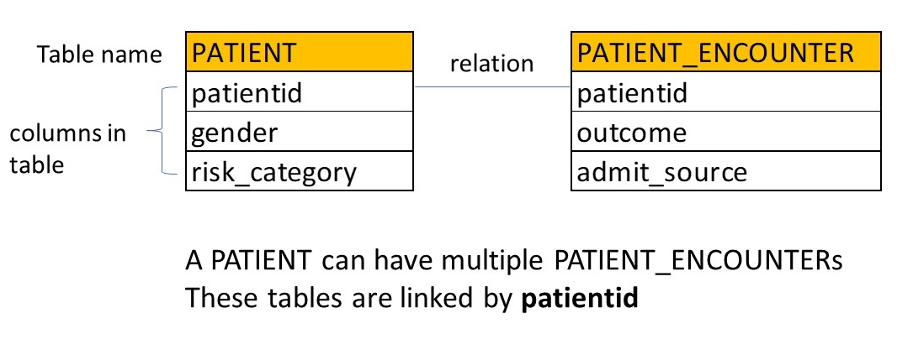

```{r setup, include=FALSE}
options(htmltools.dir.version = FALSE, echo=FALSE)
library(xaringanthemer)
mono_light(
  base_color = "midnightblue",
  header_font_google = google_font("Josefin Sans"),
  text_font_google   = google_font("Montserrat", "300", "300i"),
  code_font_google   = google_font("Droid Mono"),
  link_color = "deepskyblue1",
  text_font_size = "28px"
)
```
---
# Installing software via `conda`

https://geohackweek.github.io/Introductory/01-conda-tutorial/

---

# Shell Scripting (Chapters 23-26)

- How to set up a shell script
- What a she-bang is (23.3)

---
# Pipes (Chapter 18)

- Know what a pipe `|` is and why it's useful

---
# Regular Expressions (Chapter 21)

- Used to specify string matching queries
- Highly flexible

---

class: center, middle

# Disclaimer: I got a C in the Database Course
## (Now I teach about them)

---
# Learning Objectives

- Define what a database is
- Define what a Database Management System (DBMS) is
- Define what data model is
- Define what the Structured Query Language (SQL) is for

---
# What is a Database?

A collection of data organized in a way that can be easily accessed, managed, and updated

---
# Flat Files/Tables

A database can be simple as a collection of flat files

- organized in a file system
- specific programs to access/update

---
# Flat Files/Tables have Disadvantages

- lack of access control/security
- lack of data integrity (did we both update a table at once?)
- lack of quick access to specific data

---
# Database Management Systems (DBMS)

Software that allows for the creation, defintion, and manipulation of data in the database

- accommodates large datasets (storage; querying; indexing)
- ensures data integrity when multiple users are accessing/modifying it at once (concurrency)
- crash recovery, logging
- security and access control

---
# Relational Data Model

```{r echo=FALSE}

```

---
# Structured Query Language

- Used to create, modify, and query tables in a relational database
- Verbs
  - `SELECT`, `CREATE TABLE`, `INNER JOIN`
- Modifiers
  - `FROM`, `WHERE`, `LIKE`
- Criteria
  - `Year > 2005`
- A sequence of SQL commands is called a *query*

---
# Structured Query Language example

```{r echo=FALSE}
knitr::include_graphics("image/Slide3.JPG")
```


